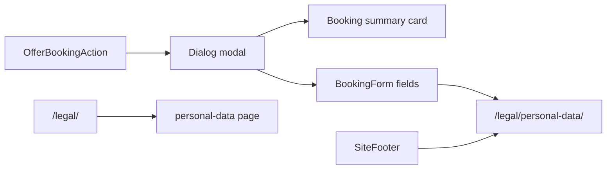

# План: анкета записи + политика ПДн

## Цель

1. Довести модалку заявки до уровня референса из [`example__schedule-board/schedule-board.html`](example__schedule-board/schedule-board.html).
2. Опубликовать на сайте страницу **политики обработки персональных данных** на основе [`example__schedule-board/brainmaster-politika-obrabotki-personalnyh-dannyh.txt`](example__schedule-board/brainmaster-politika-obrabotki-personalnyh-dannyh.txt) с аккуратной вёрсткой и ссылками из формы и футера.

## Часть A — страница политики и служебные документы

### Маршруты (static export, `trailingSlash: true`)

| URL | Назначение |
|-----|------------|
| `/legal/` | Хаб служебных документов (короткий список ссылок) |
| `/legal/personal-data/` | Политика обработки ПДн (основной документ) |

Других готовых юридических текстов в `example__schedule-board/` нет — **не добавлять пустые заглушки** (оферта, cookies). Хаб `/legal/` сразу заложить под расширение: при появлении нового документа — одна запись в реестре + новая страница.

### Контент и адаптация текста

Источник — [`brainmaster-politika-obrabotki-personalnyh-dannyh.txt`](example__schedule-board/brainmaster-politika-obrabotki-personalnyh-dannyh.txt).

При переносе **минимально адаптировать** формулировки под фактический канал сбора на Quest Hub (сейчас форма на сайте → `NEXT_PUBLIC_LEAD_SUBMIT_URL`, не Яндекс.Формы):

- п. 1.2, 1.5 — «анкета на сайте BrainMaster Quest Hub» + URL политики;
- п. 4.1, 4.6 — обработка через ИС Оператора / сервис приёма заявок (без привязки только к Яндекс.Формам); при необходимости оставить упоминание обработчиков (Яндекс и т.п.) в обобщённом виде;
- остальные разделы (1–9) — без смысловых изменений.

Структурировать контент как массив секций в [`apps/web/content/legal/personal-data-policy.ts`](apps/web/content/legal/personal-data-policy.ts) (заголовок, подпункты, списки) — не один HTML-простыней, чтобы проще править и тестировать.

### UI страницы политики

Новые компоненты:

- [`apps/web/components/legal-document-layout.tsx`](apps/web/components/legal-document-layout.tsx) — обёртка: hero (H1, подзаголовок оператора, дата актуализации), **карточка контактов** (ИНН, ОГРНИП, адреса, `ask@b-master.pro`, `+7 (977) 967-88-00` из п. 1.4), оглавление с якорями, основной текст.
- Переиспользовать визуальный язык [`ContentSection`](apps/web/components/content-section.tsx) / тёмные карточки сайта: `rounded-2xl`, `border-white/10`, типографика `font-heading` для заголовков разделов, `text-muted-foreground` для подписей.

Страницы:

- [`apps/web/app/legal/page.tsx`](apps/web/app/legal/page.tsx) — хаб.
- [`apps/web/app/legal/personal-data/page.tsx`](apps/web/app/legal/personal-data/page.tsx) — политика + `metadata` (title, description).

### Ссылки на политику

| Место | Изменение |
|-------|-----------|
| [`apps/web/components/booking-form.tsx`](apps/web/components/booking-form.tsx) | В тексте согласия — ссылка «политикой обработки персональных данных» на `/legal/personal-data/` (`target="_blank"` `rel="noopener noreferrer"` или same-tab — предпочтительно **новая вкладка**, чтобы не терять черновик формы). Под кнопкой — короткий дисклеймер как в референсе. |
| [`apps/web/components/offer-booking-action.tsx`](apps/web/components/offer-booking-action.tsx) | При визуальной доработке модалки — тот же дисклеймер под CTA. |
| [`apps/web/components/site-footer.tsx`](apps/web/components/site-footer.tsx) | Блок «Документы»: Политика ПДн, все документы → `/legal/`. |

Константа пути: [`apps/web/lib/legal-routes.ts`](apps/web/lib/legal-routes.ts) — `LEGAL_PERSONAL_DATA_PATH`, чтобы не дублировать строки.

## Часть B — визуал анкеты (референс)

### [`offer-booking-action.tsx`](apps/web/components/offer-booking-action.tsx)

- Scoped-стили `DialogContent`: `sm:max-w-[410px]`, тёмный фон, border, padding.
- Заголовок: «Оформление заявки» / «Заявка в лист ожидания».
- Передать в форму `summary`: площадка, программа, даты (`offer.dateRange`), формат/время (`variant`), цена (`variant.priceLabel ?? offer.priceLabel`).

### [`booking-form.tsx`](apps/web/components/booking-form.tsx)

- **Summary-card** сверху (как в референсе): площадка cyan, название, строки Даты / Формат / К оплате.
- Сетка полей 2×2 + textarea; тёмные инпуты, focus cyan.
- CTA full-width, градиент cyan → blue, «Забронировать место» / waitlist-вариант.
- Согласие + ссылка на политику (часть A).
- Без изменений `leadSchema` / payload.

## Тесты и проверки

- E2E [`quest-schedule.spec.ts`](apps/web/e2e/quest-schedule.spec.ts): открытие диалога, видимость summary, ссылка на политику с корректным `href`.
- E2E smoke: `/legal/personal-data/` отдаёт H1 и ключевой раздел (например «Общие положения»).
- Visual [`schedule-board.visual.spec.ts`](apps/web/e2e/schedule-board.visual.spec.ts): snapshot открытой модалки (опционально).
- `cd apps/web && npm run lint`
- `cd apps/web && npm run build` (static export должен включить новые `/legal/*` маршруты)
- Запись в [`docs/execution-log.md`](docs/execution-log.md)

## Вне скоупа

- Полная юридическая ревизия текста юристом (только техадаптация канала сбора).
- Новые документы без исходника (оферта, согласие на фото) — только структура хаба `/legal/`.

## Порядок реализации

1. Контент политики + layout + страницы `/legal/*`
2. Ссылки в footer и booking-form
3. Визуал модалки и summary-card
4. Тесты, build, execution-log
