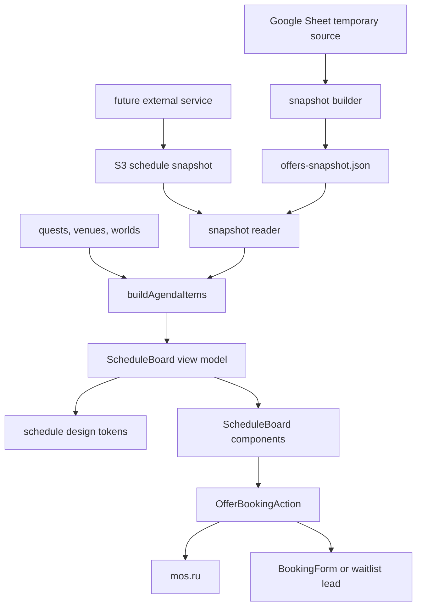

# План Внедрения Schedule Board

## Цель
Сделать страницу расписания на основном сайте на базе текущей архитектуры Next.js, но модель данных расширять в пользу целевого UX/UI. Прототип из `[example__schedule-board/schedule-board.html](example__schedule-board/schedule-board.html)` использовать как UX-референс и как ориентир по данным: если поле нужно для сильной карточки, статуса, CTA, изображений или фильтров, оно должно попасть в контракт, даже если текущий Google Sheet пока беднее.

Временный источник данных остается Google Sheet, но целевая архитектура должна быть готова к будущему S3 snapshot, который будет обновляться внешним сервисом.

## Текущий Статус
Первая реализационная итерация выполнена на ветке `feat/schedule-board`.

Готово:

- Расширен `VenueOffer` через `scheduleCard` в `[apps/web/lib/schemas.ts](apps/web/lib/schemas.ts)`.
- Расширен Google Sheet adapter в `[apps/web/lib/offers/sheet-contract.ts](apps/web/lib/offers/sheet-contract.ts)` и `[apps/web/lib/offers/map-rows-to-offers.ts](apps/web/lib/offers/map-rows-to-offers.ts)`.
- Добавлен helper/view-model слой `[apps/web/lib/offers/schedule-board.ts](apps/web/lib/offers/schedule-board.ts)`.
- Добавлен component layer `schedule-board*` в `[apps/web/components/](apps/web/components/)`.
- Новый Schedule Board подключён через `[apps/web/components/offer-agenda.tsx](apps/web/components/offer-agenda.tsx)`, поэтому работает для `/agenda` и `/sites/[school]/agenda`.
- Schedule design tokens добавлены в `[apps/web/app/globals.css](apps/web/app/globals.css)`.
- Добавлены media-гайд и SVG-шаблоны в `[docs/design/schedule-card-media.md](docs/design/schedule-card-media.md)` и `[docs/design/assets/schedule-card-media/](docs/design/assets/schedule-card-media/)`.
- Добавлен Playwright smoke/data-rule контур: `[apps/web/playwright.config.ts](apps/web/playwright.config.ts)` и `[apps/web/e2e/](apps/web/e2e/)`.
- Waitlist lead flow финализирован как обычная заявка с явным `leadType=waitlist`; обычные заявки отправляются с `leadType=booking`.
- S3 snapshot contract описан в `[docs/data/schedule-snapshot-contract.md](docs/data/schedule-snapshot-contract.md)`, а `[apps/web/lib/offers/snapshot-io.ts](apps/web/lib/offers/snapshot-io.ts)` умеет читать локальный snapshot или публичный S3 URL через один валидатор.
- Добавлены Playwright visual snapshots для detailed card, compact card и mobile viewport в `[apps/web/e2e/schedule-board.visual.spec.ts](apps/web/e2e/schedule-board.visual.spec.ts)`.

Проверено:

- `make check` прошёл.
- `npx playwright test` прошёл: 14 тестов.
- `npx playwright test e2e/schedule-board-data.spec.ts` прошёл: 10 тестов.
- `make check` повторно прошёл после waitlist/S3 contract изменений.
- `npx playwright test e2e/schedule-board.visual.spec.ts --project=chromium` прошёл: 3 теста.
- `make check` повторно прошёл после visual regression изменений.

Открытые замечания:

- Есть Turbopack warning про tracing `snapshot-io.ts`; сборку не блокирует.
- `npm install` показал 2 moderate vulnerabilities; `npm audit fix` не запускался, чтобы не вносить широкие dependency-изменения без отдельного решения.
- В git tree есть изменения, которые могли существовать до этой итерации (`docs/README.md`, `docs/execution-log.md`, `apps/web/tsconfig.json`); перед PR нужно отделить релевантные изменения от чужих.

## Текущая Архитектура
У сайта уже есть рабочий контур расписания:

- `[apps/web/app/agenda/page.tsx](apps/web/app/agenda/page.tsx)` — глобальная страница расписания.
- `[apps/web/app/sites/[school]/agenda/page.tsx](apps/web/app/sites/[school]/agenda/page.tsx)` — расписание конкретной площадки.
- `[apps/web/components/offer-agenda.tsx](apps/web/components/offer-agenda.tsx)` — текущий таймлайн карточек.
- `[apps/web/lib/offers/agenda.ts](apps/web/lib/offers/agenda.ts)` — сборка и группировка расписания.
- `[apps/web/lib/schemas.ts](apps/web/lib/schemas.ts)` — текущий контракт `VenueOffer`, который нужно расширить под Schedule Board.
- `[apps/web/components/offer-booking-action.tsx](apps/web/components/offer-booking-action.tsx)` и `[apps/web/components/booking-form.tsx](apps/web/components/booking-form.tsx)` — существующая запись через форму или mos.ru.

План: развивать эти файлы и добавить компонентный слой Schedule Board. Данные расширяем осознанно, но не заводим отдельное SPA-приложение и не копируем моковую структуру прототипа без нормализации.

## Архитектурный Поток

## Этап 1: Зафиксировать UX-Контракт
Сначала явно описать, какие паттерны из прототипа переносим:

- Статусы: `Идёт набор`, `Скоро старт`, `Можно присоединиться`, `Мест нет`, `Завершено`, `Отменено`.
- Приоритеты статусов: отмена и архив выше sold-out; sold-out вычисляется по `enrolled >= maxCapacity`.
- CTA: mos.ru имеет приоритет над локальной формой; архив и отмена блокируют запись; sold-out регулируется данными через булево поле `allowWaitlistWhenSoldOut`.
- Карточка: крупный visual block, дата в таймлайне, площадка, метро/адрес, возраст, цена, часы, статус, capacity, teacher/mentor, tags, mos.ru code, формат участия, расширенные изображения.
- Два режима: `detailed` для продажи/сторителлинга и `compact` для быстрого сравнения.
- Фильтры: площадка, программа/мир, статус, архив; сброс активен только при измененных фильтрах.

## Этап 2: Расширить Модель Данных
Расширять данные под UX/UI, а не сжимать UI до текущего `VenueOffer`.

- Расширить `[apps/web/lib/schemas.ts](apps/web/lib/schemas.ts)` для `VenueOffer` или выделить вложенную `scheduleCard`-структуру.
- Поля первой очереди: `displayTitle`, `description`, `teacherName`, `tags`, `formatType`, `formatTime`, `formatNote`, `mosRuCode`, `status`, `isArchived`, `allowWaitlistWhenSoldOut`, `capacity`, `media`.
- `media` должен поддерживать минимум 2 изображения карточки: hero/detail image и compact/thumbnail image, плюс alt, focal point и fallback.
- Сохранить ISO-поля `startDate`, `endDate`, `startTime`, `endTime` как источник сортировки и архивации; декоративные строки строить из них или хранить как optional display labels.
- Обновить `[apps/web/lib/offers/map-rows-to-offers.ts](apps/web/lib/offers/map-rows-to-offers.ts)` так, чтобы Google Sheet временно заполнял новый контракт.
- Обновить snapshot format в `[apps/web/data/offers-snapshot.json](apps/web/data/offers-snapshot.json)` с версионированием, чтобы позднее заменить источник на S3 без переписывания UI.
- Добавить reader/adapter слой для будущего S3 snapshot: UI должен зависеть от нормализованного контракта, а не от Google Sheet.

## Этап 3: View Model и Бизнес-Логика
Построить адаптер над расширенными данными:

- Добавить helper-модуль вроде `[apps/web/lib/offers/schedule-board.ts](apps/web/lib/offers/schedule-board.ts)`.
- На вход: `AgendaOfferItem` из `[apps/web/lib/offers/agenda.ts](apps/web/lib/offers/agenda.ts)`.
- На выход: view model карточки с полями для UI: `status`, `statusVariant`, `capacity`, `dateLabel`, `timeLabel`, `priceLabel`, `questHref`, `bookingMode`, `media`, `tokens`.
- Sold-out CTA вычислять так: если мест нет и `allowWaitlistWhenSoldOut === true`, показывать waitlist CTA; иначе disabled/state-only.
- mos.ru сохраняет приоритет над локальной формой, если карточка не архивная/не отмененная.
- Все вычисления статусов, capacity и архивности вынести в чистые функции с unit-test-ready API.

## Этап 4: Компоненты Schedule Board
Все, что можно упаковать в компонент, упаковать; все, что может быть расширено и переиспользовано, выделить как самостоятельный слой.

- `[apps/web/components/schedule-board.tsx](apps/web/components/schedule-board.tsx)` — контейнер страницы, фильтры, режимы, группировка.
- `[apps/web/components/schedule-board-card.tsx](apps/web/components/schedule-board-card.tsx)` — карточка, общая оболочка detailed/compact.
- `[apps/web/components/schedule-board-card-detailed.tsx](apps/web/components/schedule-board-card-detailed.tsx)` — насыщенный режим.
- `[apps/web/components/schedule-board-card-compact.tsx](apps/web/components/schedule-board-card-compact.tsx)` — режим сравнения.
- `[apps/web/components/schedule-board-toolbar.tsx](apps/web/components/schedule-board-toolbar.tsx)` — фильтры, reset, переключатель режима.
- `[apps/web/components/schedule-status-badge.tsx](apps/web/components/schedule-status-badge.tsx)` — статус и variant mapping.
- `[apps/web/components/schedule-capacity-indicator.tsx](apps/web/components/schedule-capacity-indicator.tsx)` — места, прогресс, sold-out.
- `[apps/web/components/schedule-media.tsx](apps/web/components/schedule-media.tsx)` — изображения, градиенты, focal point, fallback.
- `[apps/web/components/schedule-tariff-list.tsx](apps/web/components/schedule-tariff-list.tsx)` — форматы участия.
- Расширить `[apps/web/components/offer-booking-action.tsx](apps/web/components/offer-booking-action.tsx)` для disabled/waitlist/sold-out labels без дублирования формы.

## Этап 5: Дизайн-Токены и Темизация
Стиль оставить как у сайта, но выделить настройки Schedule Board в токены.

- Вынести schedule-specific CSS variables или Tailwind token layer для: card background, card border, timeline line, active node, status colors, CTA variants, media overlay, capacity colors, compact/detailed spacing.
- Не хардкодить цвета прототипа в компонентах; использовать токены поверх текущей темы сайта.
- Заложить будущие режимы: dark, light, alternative color schemes per campaign/world/site.
- Дать компонентам props/className hooks только там, где реально нужна настройка, не превращая их в generic UI kit.
- Добавить документационный блок по токенам: что можно менять без переписывания компонентов.

## Этап 6: Изображения и Гайд Для Дизайнеров
Подготовить полный список графики для каждой карточки и шаблоны видимых зон.

### Необходимые Изображения

- `heroImage`: основное изображение для detailed card и верхнего мобильного баннера.
- `compactImage`: кадрированное изображение для compact card, где важный объект читается в горизонтальном и вертикальном crop.
- `fallbackImage` или world-level fallback: если карточка не имеет уникального изображения.
- `alt`: обязательный текст для доступности.
- `focalPoint`: координаты фокуса, например `{ x: 50, y: 42 }`, чтобы CSS object-position держал важный объект в видимой области.

### Рекомендуемые Форматы

- Hero: WebP/JPEG, 16:9, минимум 1600x900, желательно 2400x1350.
- Compact: WebP/JPEG, 4:3 или 3:2, минимум 1200x800.
- Safe area: важный объект должен оставаться в центральной зоне 60% ширины и 60% высоты.
- Нельзя размещать критичный текст на изображении: поверх будут градиенты, бейджи и адаптивный crop.

### Артефакты Для Дизайнеров

- Создать markdown-гайд вроде `[docs/design/schedule-card-media.md](docs/design/schedule-card-media.md)`.
- Создать SVG/PNG-шаблоны с разметкой safe area, crop zones, overlay gradient zones для detailed desktop, compact desktop, mobile.
- Сохранить шаблоны в папку вроде `[docs/design/assets/schedule-card-media/](docs/design/assets/schedule-card-media/)`.
- Добавить примеры: где будет статусный бейдж, где затемнение, какие части изображения могут быть обрезаны.

## Этап 7: UI/UX Реализация
Переносить визуальные решения выборочно:

- Оставить темную, premium-edtech эстетику текущего сайта, не копировать все цвета прототипа один в один.
- Использовать новые `heroImage`/`compactImage`, а при отсутствии — `quest.heroImageUrl`, `world` visual или текущие иконки `getWorldVisual` как fallback.
- Не использовать кликабельные `div`/`h3`; сделать семантические `Link`/`button`.
- Добавить `data-testid` только на стабильные узлы, которые реально нужны для тестов: карточка, статус, capacity, CTA, view-mode toggle, filters, empty state.
- Учитывать `prefers-reduced-motion` для анимаций карточек и аккордеонов.

## Этап 8: Тесты Для Сравнения UI/UX
Да, такие тесты можно подготовить. Поскольку тестовой инфраструктуры сейчас нет, рекомендую начать с Playwright как единого контура для visual regression, E2E и a11y-smoke.

### Что Сравниваем
Не “пиксель в пиксель” с прототипом, потому что сайт имеет свою дизайн-систему. Сравниваем UX-инварианты:

- На `/agenda` видна хронология смен, даты сгруппированы стабильно.
- Карточка содержит статус, программу, площадку, дату/время, цену, возраст/места, изображения и CTA.
- mos.ru-смена открывает внешнюю ссылку, а смена без ссылки открывает форму.
- sold-out отображает `Мест нет`; если `allowWaitlistWhenSoldOut=true`, доступен waitlist CTA, иначе действие заблокировано.
- архивная/прошедшая смена не предлагает обычную запись.
- compact/detailed view переключаются без потери CTA и ключевой информации.
- фильтры меняют выдачу и имеют рабочий reset.
- мобильная ширина не дает горизонтального скролла.
- hero/compact images не ломают layout и используют корректный fallback.

### Набор Тестов
Добавить Playwright:

- `apps/web/e2e/schedule-board.spec.ts` — сценарии пользователя.
- `apps/web/e2e/schedule-board.visual.spec.ts` — скриншоты на 375, 768, 1440 px.
- `apps/web/e2e/schedule-board.a11y.spec.ts` — базовая проверка клавиатурного доступа и видимых labels/focus states.
- `apps/web/e2e/schedule-board-data.spec.ts` — fixture-сценарии для sold-out с waitlist, sold-out без waitlist, mos.ru, архив, отсутствующее изображение.
- При желании позже добавить `@axe-core/playwright`, но стартовать можно без него, чтобы не раздувать первый PR.

### Baseline Прототипа
Для сравнения с `example__schedule-board` есть два варианта:

- Быстрый: вручную сохранить 3-4 reference screenshots прототипа и использовать их как UX-референс в PR, без автоматического pixel match.
- Автоматический: обернуть прототип в отдельную preview-страницу или static fixture и снять Playwright screenshots. Это точнее, но увеличивает объем работ и может смешать черновой код с production-приложением.

Рекомендация: в первом PR сделать автоматические тесты новой страницы и ручной UX-baseline по прототипу; автоматизировать сравнение с прототипом только если нужно регулярно проверять дизайн-дрейф. Для дизайнерских изображений добавить отдельные screenshot-тесты по crop zones, чтобы случайно не сломать видимую область в compact/detailed/mobile.

## Этап 9: Проверки и Критерии Готовности

- `make check` проходит.
- Playwright E2E проходит локально.
- `/agenda` и `/sites/[school]/agenda` используют один компонентный контур.
- Нет параллельных моковых данных в production-коде.
- CTA сохраняет текущую отправку лидов и mos.ru поведение.
- Sold-out CTA управляется `allowWaitlistWhenSoldOut`.
- Расширенный snapshot имеет версию и готов к будущей замене Google Sheet на S3 source.
- Дизайн-токены расписания вынесены и не размазаны хардкодом по карточкам.
- Гайд и шаблоны изображений готовы для дизайнеров.
- На 375 px нет горизонтального скролла.
- В карточках нет падений при `teacher/image/capacity/variants`-аналогах, которых нет в текущем контракте.

## Дальнейшие Действия

### 1. UX/UI ревью в браузере

- Проверить `/agenda` и минимум 2 школьные страницы `/sites/[school]/agenda` на ширинах 375, 768, 1024, 1440.
- Сравнить UX-инварианты с прототипом из `[example__schedule-board](example__schedule-board)`: читаемость карточки, таймлайн, режимы detailed/compact, CTA, пустые состояния.
- Зафиксировать дефекты по категориям: layout, copy, status/CTA, mobile, accessibility, performance.

### 2. Наполнение расширенной модели данных

- Добавить в Google Sheet временные колонки под `scheduleCard`: `display_title`, `description`, `teacher`, `tags`, `format_type`, `format_time`, `format_note`, `allow_waitlist_when_sold_out`, `hero_image_url`, `compact_image_url`, `fallback_image_url`, `image_alt`, `image_focal_x`, `image_focal_y`.
- Согласовать обязательность полей для MVP: без изображений карточка работает через fallback, но без `format_type` и `allow_waitlist_when_sold_out` бизнес-смысл CTA беднее.
- После заполнения выполнить sync и проверить, что `[apps/web/data/offers-snapshot.json](apps/web/data/offers-snapshot.json)` содержит новый `scheduleCard`.

### 3. Waitlist lead flow

- Выполнено: контракт заявки расширен полем `leadType: "booking" | "waitlist"`.
- Выполнено: `[apps/web/components/offer-booking-action.tsx](apps/web/components/offer-booking-action.tsx)` и `[apps/web/components/booking-form.tsx](apps/web/components/booking-form.tsx)` передают waitlist как явный payload и показывают waitlist-контекст в диалоге.
- Выполнено: добавлен data-rule тест, который фиксирует `leadType=waitlist` для waitlist payload.

### 4. Visual regression и UI/UX сравнение

- Выполнено: добавлен `[apps/web/e2e/schedule-board.visual.spec.ts](apps/web/e2e/schedule-board.visual.spec.ts)` со скриншотами detailed/compact/mobile.
- Выполнено: тест замораживает дату, дожидается видимости board, отключает motion/caret и ждёт `document.fonts.ready` перед screenshot-сравнением.
- Сохранить reference screenshots прототипа как PR-артефакты или отдельный docs-раздел, не смешивая черновой прототип с production-кодом.

### 5. S3 snapshot contract

- Выполнено: JSON-контракт будущего внешнего сервиса описан в `[docs/data/schedule-snapshot-contract.md](docs/data/schedule-snapshot-contract.md)`.
- Выполнено: reader abstraction поддерживает локальный snapshot по умолчанию и build-time S3 snapshot через `OFFERS_SNAPSHOT_URL` или `OFFERS_SNAPSHOT_SOURCE=s3` + `NEXT_PUBLIC_S3_PUBLIC_BASE_URL`.
- Выполнено: snapshot остается версионированным через `version: 1`; расширенные поля проходят через нормализованный `VenueOffer.scheduleCard`.

### 6. PR cleanup и финальная проверка

- Проверить `git diff` и отделить изменения, не относящиеся к Schedule Board.
- Удалить generated artifacts вроде Playwright `test-results`, если появятся.
- Обновить `[docs/execution-log.md](docs/execution-log.md)` записью по Schedule Board.
- Прогнать `make check` и `npx playwright test`.

## Риски

- Расширение `VenueOffer` должно быть нормализовано: UX-поля нужны, но их лучше группировать в понятные вложенные структуры, чтобы не превратить snapshot в плоскую простыню.
- Google Sheet временно станет шире и хрупче; нужно проектировать контракт сразу под S3 snapshot, а Sheet считать adapter/input format.
- Visual regression может быть шумным из-за анимаций и шрифтов; перед скриншотами нужно отключать/стабилизировать motion.
- Автоматическое сравнение с прототипом будет спорным, потому что прототип не использует текущую дизайн-систему сайта.
- Для waitlist нужно решить payload: это обычная заявка с признаком waitlist или отдельный тип лида.
- Изображения могут стать узким местом качества: без safe-area шаблонов дизайнеры будут регулярно отдавать кадры, которые плохо работают в compact/mobile crop.