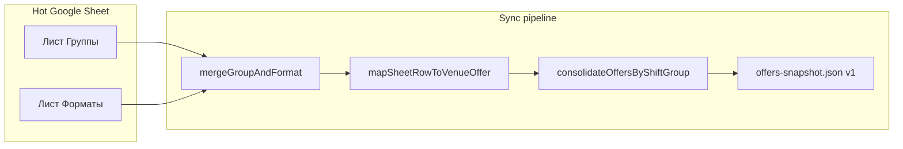
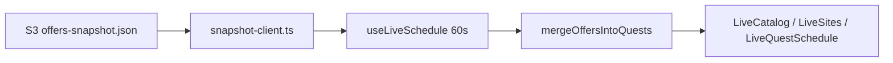

# HOT-данные: структура и устройство

**Hot tier** — расписание смен и тарифов (цены, даты, набор, mos.ru). Тексты курсов, площадки и миры — это **Cold** ([google-sheets-editor-guide.md](./google-sheets-editor-guide.md)).

**JSON-контракт снимка:** [schedule-snapshot-contract.md](./schedule-snapshot-contract.md)  
**Публикация и команды:** [content-deploy.md](../deployment/content-deploy.md)  
**Диагностика инцидентов:** [content-pipeline-status-plan.md](../deployment/content-pipeline-status-plan.md)

---

## 1. Назначение

| | Hot | Cold |
|---|-----|------|
| Что меняется | Смены, тарифы, цены, статусы набора | Курсы, площадки, миры, SEO-тексты |
| Артефакт | `data/offers-snapshot.json` | `data/v2/catalog`, `map`, `detail/*` |
| На проде | Браузер, poll ~60 с, **без** rebuild Timeweb | Static HTML после Timeweb deploy |

Редакторы работают в **Hot Google Sheet**; sync превращает две вкладки в нормализованный JSON для сайта.

---

## 2. Google Sheet

| | |
|---|---|
| **Назначение** | Редактор расписания |
| **Spreadsheet ID** | `1ut5AhfJqx9wrJE3tTCzrkrQdCmWsCPB8cueHH3QsLy8` |
| **Ссылка** | [Открыть таблицу](https://docs.google.com/spreadsheets/d/1ut5AhfJqx9wrJE3tTCzrkrQdCmWsCPB8cueHH3QsLy8/edit) |

### Листы (актуальная модель)

| Лист | Строка = | Диапазон по умолчанию |
|------|----------|------------------------|
| **Группы** | одна смена (одна карточка на сайте) | `'Группы'!A:AZ` |
| **Форматы** | один тариф внутри смены | `'Форматы'!A:AZ` |

Связь **1 : N** по колонке `shift_group_id`.

Лист **`Расписание`** (плоский legacy, одна строка = смена+тариф) **больше не читается** sync-ом.

### Переменные окружения

| Переменная | Назначение |
|------------|------------|
| `GOOGLE_SHEETS_HOT_SPREADSHEET_ID` | ID Hot-таблицы (fallback: `GOOGLE_SHEETS_SPREADSHEET_ID`) |
| `GOOGLE_SHEETS_HOT_RANGE_GROUPS` | Диапазон листа «Группы» |
| `GOOGLE_SHEETS_HOT_RANGE_FORMATS` | Диапазон листа «Форматы» |
| `GOOGLE_SERVICE_ACCOUNT_JSON` | Ключ сервисного аккаунта (Editor на таблице) |

Конфиг в коде: [`apps/web/lib/google/sheet-env.ts`](../../apps/web/lib/google/sheet-env.ts).

---

## 3. Модель данных

### Лист «Группы»

Общие поля **смены** (одна строка на карточку Schedule Board).

**Обязательные колонки** (`GROUP_REQUIRED_HEADERS` в [`sheet-contract.ts`](../../apps/web/lib/offers/sheet-contract.ts)):

| Колонка | Смысл |
|---------|--------|
| `shift_group_id` | Стабильный ID смены; ключ связи с «Форматы» |
| `program_name_h2` | Название курса (h2) |
| `quest_slug` | Slug квеста из Cold / `content/quests` |
| `venue_slug` | Slug площадки из Cold / `content/venues` |
| `start_date` | Начало смены, `YYYY-MM-DD` |
| `end_date` | Конец смены, `YYYY-MM-DD` |
| `address` | Адрес проведения |
| `status` | Статус набора (напр. «Идёт набор», «Мест нет») |

**Рекомендуемые:** `program_name_h1`, `school_name`.

**Дополнительные** (валидация в Zod, см. `sheetGroupRowSchema`):

| Колонка | Смысл |
|---------|--------|
| `metro_station` | Станция метро |
| `teacher` | Педагог(и) |
| `max_capacity` | Вместимость **на всю смену** |
| `notes` | Заметки (в т.ч. для infer типа формата) |
| `description` | Описание на карточке |
| `tags` | Теги через `;` или `,` |
| `is_archived` | Архивная смена |
| `allow_waitlist_when_sold_out` | Лист ожидания при «Мест нет» |

Старая колонка `program_name` при sync делится на `program_name_h1` / `program_name_h2` по первому `:` ([`splitProgramName`](../../apps/web/lib/offers/program-name.ts)).

### Лист «Форматы»

Поля **тарифа** внутри смены. Несколько строк с одним `shift_group_id` → несколько тарифов в одной карточке.

**Обязательные колонки** (`FORMAT_REQUIRED_HEADERS`):

| Колонка | Смысл |
|---------|--------|
| `shift_group_id` | Ссылка на строку «Группы» |
| `start_time` | Начало занятий, `H:MM` |
| `end_time` | Конец занятий |
| `price` | Цена (руб.), см. нормализацию ниже |

**Дополнительные** (`sheetFormatRowSchema`):

| Колонка | Смысл |
|---------|--------|
| `format_type` | Название тарифа; если пусто — infer из `notes`/длительности |
| `format_note` | Пояснение к тарифу |
| `enrolled` | Записано (на **этот** тариф) |
| `mos_ru_code` | Код mos.ru |
| `mos_ru_link` | URL записи mos.ru |
| `age_group` | Возрастная группа |
| `registration_channel` | `mos_ru` \| `brainmaster` |
| `allow_preliminary_registration` | Предварительная запись |

Колонки **`format_time` в таблице нет** — подпись времени на сайте строится из дат группы и `start_time`/`end_time` формата.

**Медиа** (если есть в шапке листа): `hero_image_url`, `compact_image_url`, `fallback_image_url`, `image_alt`, `image_focal_x`, `image_focal_y` — попадают в merged row и `scheduleCard.media`.

Полный список ключей для join: [`HOT_GROUP_FIELD_KEYS`](../../apps/web/lib/offers/sheet-hot-join.ts), [`HOT_FORMAT_FIELD_KEYS`](../../apps/web/lib/offers/sheet-hot-join.ts).

### Join группы и формата

[`mergeGroupAndFormat`](../../apps/web/lib/offers/sheet-hot-join.ts) склеивает строку «Группы» и строку «Форматы» в один объект для [`sheetRowSchema`](../../apps/web/lib/offers/sheet-contract.ts).

Правила при конфлике имён: поля формата перекрывают одноимённые только если они относятся к `HOT_FORMAT_FIELD_KEYS`; поля группы — из `HOT_GROUP_FIELD_KEYS`.

### Цена

Допустимы `8500`, `'8500`, `8 500`, `14'000,00`, `8 500 ₽` — нормализация в [`sheet-field-parsers.ts`](../../apps/web/lib/offers/sheet-field-parsers.ts).

Строки с **ценой 0** на «Форматы» **пропускаются** (`isZeroPrice` в sync).

---

## 4. Pipeline sync



Точка входа: [`syncHotOffersFromGoogleSheet`](../../apps/web/lib/offers/sync-hot-core.ts).

| Шаг | Действие |
|-----|----------|
| 1 | Параллельно загрузить сетки «Группы» и «Форматы» |
| 2 | Проверить обязательные заголовки (`validateHeaderRow`) |
| 3 | Распарсить «Группы» → `Map<shift_group_id, row>`; дубликат `shift_group_id` → ошибка |
| 4 | Для каждой строки «Форматы»: найти группу, `mergeGroupAndFormat`, валидация `sheetRowSchema` |
| 5 | `mapSheetRowToVenueOffer` — проверка `venue_slug` / `quest_slug` |
| 6 | `consolidateOffersByShiftGroup` — N mapped rows → 1 offer с `variants[]` |
| 7 | `collectDuplicateIds` — дубликаты `id` оффера → ошибка |
| 8 | `groupOffersByQuest` → `OffersSnapshotV1` |

CLI: `make publish-sheet-hot` → [`scripts/publish-sheet-hot.mjs`](../../scripts/publish-sheet-hot.mjs) → sync + validate + `run-s3-sync.mjs data-hot` (only `offers-snapshot.json` on S3).

CI: [`.github/workflows/sheet-sync.yml`](../../.github/workflows/sheet-sync.yml) по webhook content-admin.

### Типичные ошибки sync

| Сообщение | Причина |
|-----------|---------|
| `Не хватает колонок: …` | Неверная шапка листа |
| `дубликат shift_group_id` | Две строки на «Группы» с одним ID |
| `нет группы с shift_group_id` | Строка «Форматы» без родительской группы |
| `Неизвестный venue_slug` | Площадка не в Cold / YAML |
| `quest_slug … не найден в каталоге` | Курс не в каталоге |
| `Дубликаты id офферов` | Два оффера с одним `sheet:{shift_group_id}` после consolidate |
| `Несовпадение полей группы смены` | Строки одного `shift_group_id` различаются по датам/квесту/площадке |

---

## 5. Идентификаторы и consolidate

### `shift_group_id`

- Явное значение в колонке **приоритетно**.
- Если пусто, вычисляется:  
  `{quest_slug}:{venue_slug}:{start_date}:{end_date}`  
  ([`buildShiftGroupId`](../../apps/web/lib/offers/sheet-field-parsers.ts)).

Пересчёт на листе «Группы»: `make backfill-shift-group-ids`.

### Таблица ID

| Уровень | Формула | Пример |
|---------|---------|--------|
| Группа смены | `shift_group_id` | `minecraft-taina:…:2026-06-01:2026-06-05` |
| Оффер в snapshot | `sheet:{shift_group_id}` | `sheet:minecraft-taina:…` |
| Вариант тарифа | `{venue_slug}:{start_date}:{slugify(format_type)}` | `school-1212:2026-06-01:intensiv` |

### Consolidate

[`consolidateOffersByShiftGroup`](../../apps/web/lib/offers/map-rows-to-offers.ts): все mapped offers с одним `_shiftGroupId` сливаются в один `VenueOffer`:

- `scheduleCard.variants[]` — по одному элементу на строку «Форматы»;
- `startTime` / `endTime` на оффере — min / max по вариантам;
- `enrolled` на оффере — сумма `variants[].enrolled`;
- `daySchedule` — span по min–max времени.

При нескольких строках проверяется согласованность полей группы (`validateShiftGroupConsistency`).

UI: Schedule Board и `ScheduleTariffList` читают `scheduleCard.variants[]` (см. e2e `schedule-board-data.spec.ts`).

---

## 6. Снимок `offers-snapshot.json`

Тип: [`OffersSnapshotV1`](../../apps/web/lib/offers/snapshot-types.ts).

```json
{
  "version": 1,
  "generatedAt": "2026-05-19T12:00:00.000Z",
  "source": "google_sheet",
  "offersByQuest": {
    "<quest-slug>": [ /* VenueOffer[] */ ]
  }
}
```

| Поле | Правило |
|------|---------|
| `offersByQuest` | Ключ = `quest.slug` из контента |
| Каждый offer | Схема `VenueOffer` ([`schemas.ts`](../../apps/web/lib/schemas.ts)) |
| `source` | `google_sheet` после sync; `s3_schedule_snapshot` при внешней публикации |

**Файлы:**

- Локально (build / dev): [`apps/web/data/offers-snapshot.json`](../../apps/web/data/offers-snapshot.json)
- S3: `s3://<bucket>/data/offers-snapshot.json`  
  Публичный URL: `{NEXT_PUBLIC_S3_PUBLIC_BASE_URL}/data/offers-snapshot.json`

Полный пример полей offer и `scheduleCard` — в [schedule-snapshot-contract.md](./schedule-snapshot-contract.md).

---

## 7. Runtime на сайте



| Режим | Поведение |
|-------|-----------|
| **Production** | `NEXT_PUBLIC_S3_PUBLIC_BASE_URL` задан → браузер тянет snapshot с S3 ([`use-live-schedule.ts`](../../apps/web/lib/offers/use-live-schedule.ts), poll 60 с). **CORS** на бакете обязателен. |
| **Build / fallback** | Локальный файл или `OFFERS_SNAPSHOT_URL` / `OFFERS_SNAPSHOT_SOURCE=s3` на этапе сборки |
| **Shell** | [`loadQuestsShell()`](../../apps/web/lib/content/load.ts) — квесты без offers; offers подмешиваются клиентом |

Парсинг клиентского JSON: [`snapshot-parse.ts`](../../apps/web/lib/offers/snapshot-parse.ts).

---

## 8. Публикация: dev vs prod

| Путь | Локальный `apps/web/data/offers-snapshot.json` | S3 | Видно на localhost |
|------|-----------------------------------------------|-----|-------------------|
| `make publish-sheet-hot` | **Да** | **Да** | После **`make dev-restart`** (или ~60 с, если включён S3 client) |
| Sheets → Apps Script → GitHub Actions | **Нет** | Да, если job успешен | Обычно **нет** без S3 env; alert ≠ обновление диска |
| `make import-site-data-to-sheets --hot-only` | — | — | Заливка **из** snapshot **в** Sheet (миграция/восстановление) |

**Надёжный dev-цикл после правки таблицы:**

```bash
make publish-sheet-hot
make dev-restart
```

Порядок при новой площадке/курсе: сначала **Cold**, затем **Hot**.

Первичная настройка листов:

```bash
make seed-sheet-headers
make import-site-data-to-sheets --hot-only
make backfill-shift-group-ids
```

---

## 9. Связанные файлы в репозитории

| Файл | Роль |
|------|------|
| `apps/web/lib/offers/sheet-contract.ts` | Zod, обязательные заголовки |
| `apps/web/lib/offers/sheet-hot-join.ts` | Join группа + формат |
| `apps/web/lib/offers/sync-hot-core.ts` | Sync Sheets → snapshot |
| `apps/web/lib/offers/map-rows-to-offers.ts` | Row → VenueOffer, consolidate |
| `apps/web/lib/offers/sheet-field-parsers.ts` | Даты, цены, `buildShiftGroupId` |
| `apps/web/lib/offers/snapshot-types.ts` | Тип снимка v1 |
| `apps/web/lib/offers/snapshot-parse.ts` | Парсинг JSON |
| `apps/web/lib/offers/snapshot-client.ts` | URL и fetch в браузере |
| `apps/web/lib/offers/merge-offers.ts` | Offers → quests |
| `apps/web/lib/offers/use-live-schedule.ts` | SWR hook |
| `scripts/publish-sheet-hot.mjs` | CLI hot publish |
| `scripts/import-site-data-to-sheets.mjs` | Snapshot → Sheets |
| `scripts/seed-google-sheet-headers.mjs` | Шапки «Группы» / «Форматы» |
| `apps/yandex-content-admin` | `POST /sync/hot` |
| `.github/workflows/sheet-sync.yml` | CI sync |

---

## 10. Legacy и troubleshooting

| Тема | Статус |
|------|--------|
| Лист **«Расписание»** | Не используется; миграция на «Группы» + «Форматы» |
| Старый `offer.id` с `start_time` вместо `shift_group_id` | Заменён на `sheet:{shift_group_id}`; дубликаты при нескольких форматах без consolidate — историческая проблема |
| Первый `import-site-data-to-sheets` брал только `variants[0]` | Исправлено: строка на каждый variant; восстановление — [content-pipeline-status-plan.md](../deployment/content-pipeline-status-plan.md) § «Потеря нескольких форматов» |
| Legacy Sheet `1FCbrtck…` | Резерв до миграции; не читается sync-ом автоматически |
| Прод: пустое расписание при файле на S3 | Часто **CORS** на бакете; см. status-plan § S3 |
| Sheets alert «успех», данных нет | Dispatch workflow ≠ успешный sync; проверить Actions и дубликаты в таблице |

Два формата с **одинаковым** `format_type` (после slugify) на одной смене дают конфликт `variant.id` — задавайте различающиеся `format_type` в таблице.
