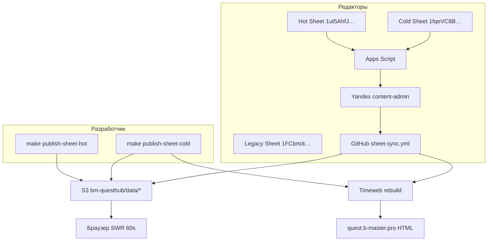

# Content pipeline: текущая ситуация и план работ

**Актуальный документ** (2026-05-19). Объединяет диагностику hot/cold publish, runtime S3, Timeweb и восстановление расписания.

**Краткая эксплуатация:** [content-deploy.md](./content-deploy.md)  
**Редактор (Sheets):** [google-sheets-editor-guide.md](../data/google-sheets-editor-guide.md)  
**Структура HOT-данных (канон):** [hot-schedule-data.md](../data/hot-schedule-data.md)

---

## Сводка для руководителя

| Вопрос | Ответ |
|--------|--------|
| Старый код на Timeweb? | Маловероятно. CSR hot path и Timeweb deploy API **уже в репозитории**. |
| S3 подключён неправильно? | Нет: `s3://bm-questhub/data/` ↔ `https://bm-questhub.s3.twcstorage.ru/data/…`. |
| Почему на проде пусто? | Комбинация: hot sync падает / snapshot урезан, **CORS на бакете не настроен** (подтверждено), env App Platform уточнить, UI скрывает школы без offers, cold из Sheets → GitHub 404. |
| Почему пропали форматы? | Первичный импорт брал только `variants[0]`; восстановление — см. [hot-schedule-data.md](../data/hot-schedule-data.md) §10 и § «Потеря нескольких форматов» ниже. |
| Dev cold после `dev-restart`? | Да: локальные `apps/web/data/v2/*`. |
| Dev hot после `dev-restart`? | **Частично:** смены видны, но **одна датовая группа = один формат** (нет тариф-листа 2+); multi-variant не восстановлен. |

---

## Целевая архитектура (гибрид)



| Tier | Файлы | Как попадает на сайт | Timeweb rebuild |
|------|--------|---------------------|-----------------|
| **Hot** | `data/offers-snapshot.json` | Браузер fetch + poll ~60 с | **Нет** |
| **Cold** | `data/v2/catalog`, `map`, `detail/*` | Build fetch с S3 → static HTML | **Да** (~2–5 мин) |
| **Код** | React/TS в git | Push → Timeweb | По push |

---

## Что уже сделано в коде (не переделывать)

### Runtime hot (план «связать App и S3»)

| Компонент | Путь |
|-----------|------|
| Parse snapshot | `apps/web/lib/offers/snapshot-parse.ts` |
| Client fetch URL | `apps/web/lib/offers/snapshot-client.ts` |
| Merge в quests | `apps/web/lib/offers/merge-offers.ts` |
| SWR hook | `apps/web/lib/offers/use-live-schedule.ts` |
| UI обёртки | `LiveCatalog`, `LiveSites`, `LiveQuestSchedule` |
| Shell без offers | `loadQuestsShell()` в `apps/web/lib/content/load.ts` |

### Producer / deploy (master plan)

| Компонент | Путь |
|-----------|------|
| Hot без redeploy | `apps/producer/deploy-hook.mjs` (`tier=hot` skip) |
| `--hot-only` | `apps/producer/publish.mjs` |
| Timeweb API deploy | `scripts/timeweb-deploy.mjs` + `timeweb-vcs.mjs` (`GITHUB_SHA` in CI) |
| Sheet publish CLI | `make publish-sheet-hot` / `make publish-sheet-cold` |
| S3 tier upload | `data-hot` / `data-cold` in `sync-s3-public.mjs` (cold does not overwrite schedule) |
| CI | `.github/workflows/sheet-sync.yml` |
| Content-admin API | `apps/yandex-content-admin` — `/sync/hot`, `/sync/cold` |

### Cold snapshots

- `catalog-snapshot.json`, `map-snapshot.json`, `detail/*.json`, loaders с `SITE_SNAPSHOT_SOURCE=s3`
- Документация: [schedule-snapshot-contract.md](../data/schedule-snapshot-contract.md) (runtime, без redeploy для offers)

### Env-шаблон Timeweb

- [apps/web/timeweb.app.env.example](../../apps/web/timeweb.app.env.example)

---

## Текущие симптомы и причины

| Симптом | Среда | Причина |
|---------|--------|---------|
| Нет смен и школ | **Прод** | Пустой/старый snapshot; **браузерный fetch блокируется без CORS на бакете**; `buildSiteScopeCards` скрывает школы до загрузки offers |
| Hot/cold из Sheets «не применяется» | **Прод** | Cold: `GitHub sheet-sync 404` на content-admin. Hot: alert «успех» = только dispatch workflow |
| Hot из Sheets на **dev** | **Dev** | Alert «выполнено», но **данные на localhost не меняются** — см. таблицу путей ниже |
| Hot локально на **dev** | **Dev** | **`make publish-sheet-hot` + `make dev-restart`** — работает (напр. цена); другие пути не обновляют dev |
| Cold обновляется | **Dev** | `publish-sheet-cold` → диск → `dev-restart` читает локальные JSON |
| Hot «работает» на dev | **Dev** | После `dev-restart` смены **есть**, но UI показывает **1 формат на группу** — ожидаемо при текущем snapshot/sync (см. ниже) |
| Hot sync падает | **Dev** | `make publish-sheet-hot` → `Дубликаты id офферов` → snapshot на диск/S3 не обновляется |
| Несколько форматов на смену | **Dev/прод** | Нужны N строк на «Форматы» + `consolidateOffersByShiftGroup` (см. [hot-schedule-data.md](../data/hot-schedule-data.md)); данные могут быть ещё не восстановлены в Sheet |
| Cold из Sheets HTTP 500 | **Sheets** | `GitHub sheet-sync 404` — PAT / `CONTENT_REBUILD_REPOSITORY` на Yandex Function |
| Cold откатывает hot на проде | **Прод** | **Исправлено:** cold больше не делает `s3 sync` всего `data/` — только `data-cold` → `data/v2/` |
| S3 map верный, на сайте старый адрес школы | **Прод** | Timeweb build: HTTP **403** на `map-snapshot.json` → тихий fallback на git/YAML; `verify:s3` раньше не проверял map/catalog — **исправлено в коде:** strict loader + расширенный verify |

---

## Dev: cold vs hot (подтверждено)

### Три способа обновить hot на dev

| Способ | Обновляет локальный `apps/web/data/offers-snapshot.json`? | Обновляет S3? | Видно на localhost после… | У вас |
|--------|-----------------------------------------------------------|--------------|---------------------------|--------|
| **`make publish-sheet-hot`** | **Да** | **Да** | **`make dev-restart`** (подтверждено: цена и др.) | **Работает** |
| **Google Sheets → Опубликовать (hot)** | **Нет** (sync только в GitHub Actions на сервере) | Только если job **успешно** завершился | Обычно **не видно** без S3-poll или локального make | **Не работает** (alert есть, данных нет) |
| Только `dev-restart` | Нет | Нет | Ничего не меняется | — |

Почему Sheets **не меняет dev**, хотя alert «скрипт выполнился»:

1. Alert = content-admin **запустил** `sheet-sync.yml`, а не «файл на вашем диске обновлён».
2. GitHub runner пишет snapshot в **S3**; ваш `apps/web/data/` на машине **не трогается**.
3. UI расписания на dev с [`use-live-schedule`](../../apps/web/lib/offers/use-live-schedule.ts) читает **`NEXT_PUBLIC_S3_PUBLIC_BASE_URL`/data/offers-snapshot.json** (если env задан), иначе при shell без S3 — устаревший локальный файл.
4. Даже при S3: job может **упасть** на шаге sync (`Дубликаты id офферов` и т.д.) — alert всё равно мог быть «успехом» dispatch.
5. Без `dev-restart` после локального make Next dev может не подхватить env/кэш; вы empirически используете пару **publish + restart** — это нормальный рабочий обход для разработки.

**Практика для dev до починки Sheets/GitHub:**

```bash
# После правки Hot-таблицы — надёжный путь на localhost:
make publish-sheet-hot
make dev-restart
```

Чтобы Sheets заработали на dev/прод: починить PAT/404 (фаза 2.1), дубликаты в таблице (фаза 1), CORS на бакете (фаза 2.0); затем на dev с `NEXT_PUBLIC_S3_PUBLIC_BASE_URL` достаточно подождать ~60 с **без** restart, если Actions зелёный.

### Cold и форматы (как раньше)

| | Cold | Hot (расписание) |
|---|------|------------------|
| После `make dev-restart` | Тексты/каталог **обновляются** (локальный `data/v2/*`) | Смены видны, но **1 группа = 1 формат** |
| Multi-format в карточке | — | `consolidateOffersByShiftGroup` в коде; нужны данные в Sheet (см. [hot-schedule-data.md](../data/hot-schedule-data.md)) |

`dev-restart` **не чинит** multi-format и **не заменяет** `make publish-sheet-hot` для hot.

---

## Подтверждённый пробел: S3 в Timeweb (не App Platform)

**Факт (2026-05-19):** в Timeweb для Object Storage **не прописывали** отдельные настройки, в том числе **CORS**. В панели App Platform (`quest.b-master.pro`) env для сборки — это **другой раздел**, он CORS не заменяет.

| Настройка | Где в Timeweb | Зачем | Статус |
|----------|---------------|--------|--------|
| Публичное чтение JSON | **Object Storage** → бакет `bm-questhub` → policy | `curl`/build fetch по HTTPS | Сверить (объекты открываются по URL?) |
| **CORS** | **Object Storage** → бакет → CORS | Браузер на проде читает `offers-snapshot.json` ([`use-live-schedule.ts`](../../apps/web/lib/offers/use-live-schedule.ts)) | **Не настроено** — вероятный блокер hot на проде |
| `NEXT_PUBLIC_S3_PUBLIC_BASE_URL` и др. | **App Platform** → приложение → Environment | Build + client URL | Сверить вручную |
| `AWS_*` в App | Не нужны | Upload идёт с локали/CI через `scripts/s3.env` | — |

Без CORS запрос с `https://quest.b-master.pro` к `https://bm-questhub.s3.twcstorage.ru/data/offers-snapshot.json` в DevTools будет **blocked by CORS**; [`snapshot-client.ts`](../../apps/web/lib/offers/snapshot-client.ts) вернёт пустой snapshot → на `/sites` нет школ, на `/agenda` нет смен (даже если файл на S3 корректный).

**Что сделать (порядок):**

1. [Timeweb Cloud → S3](https://timeweb.cloud/my/storage) → бакет `bm-questhub`.
2. **Access policy** — если ещё нет публичного `GetObject` на `data/*`: [timeweb-s3-bucket-policy.example.json](../../scripts/timeweb-s3-bucket-policy.example.json) ([инструкция](./timeweb-object-storage-setup.md) §2).
3. **CORS** — вставить правило из [timeweb-s3-cors.example.json](../../scripts/timeweb-s3-cors.example.json); добавить все прод-домены (`quest.b-master.pro`, `1517.b-master.pro`, …). [Гайд Timeweb CORS](https://timeweb.cloud/docs/s3-storage/supported-features/cors-setup).
4. Проверка с машины: `curl -sI https://bm-questhub.s3.twcstorage.ru/data/offers-snapshot.json` → **200**.
5. Проверка с прод-сайта: DevTools → Network → тот же URL → **200**, без CORS error.

Пример CORS в репозитории уже есть — нужно **применить в панели бакета**, не в настройках Next-приложения.

---

## Потеря нескольких форматов на смену

Актуальная модель Hot (листы «Группы» / «Форматы», ID, sync): **[hot-schedule-data.md](../data/hot-schedule-data.md)**.

### Источники данных

| Источник | ID / ссылка | Роль |
|----------|-------------|------|
| **Legacy (канон)** | [1FCbrtckg0mgI2lBa6IzesQVhVhLNu5Cl2uHg13dG-Uw](https://docs.google.com/spreadsheets/d/1FCbrtckg0mgI2lBa6IzesQVhVhLNu5Cl2uHg13dG-Uw/edit?gid=680457369) | Исходное расписание до миграции |
| **Hot (редактор)** | `1ut5AhfJqx9wrJE3tTCzrkrQdCmWsCPB8cueHH3QsLy8` | Листы «Группы» + «Форматы» |
| **Git резерв** | `git show b06c2e5:apps/web/data/offers-snapshot.json` | 9 offers с 2 variants (до урезания) |

### Как потерялись форматы

1. [`scripts/import-site-data-to-sheets.mjs`](../../scripts/import-site-data-to-sheets.mjs) при заливке в Hot взял только `sc.variants?.[0]` и одну строку на offer.
2. Раньше: одна строка Sheet → один offer без consolidate (исправлено: `consolidateOffersByShiftGroup`).
3. Раньше: `offer.id` с `start_time` вместо `shift_group_id` → дубликаты (исправлено: `sheet:{shift_group_id}`).

UI рассчитан на **несколько тарифов в одной карточке** (`scheduleCard.variants[]`, `ScheduleTariffList`, e2e в `schedule-board-data.spec.ts`).

---

## Следующие шаги (приоритет)

### Фаза 1 — Данные и hot publish (блокер)

- [ ] **1.1** Выдать service account **Reader** на legacy Sheet `1FCbrtck…` (gid `680457369`).
- [x] **1.2** Исправить `import-site-data-to-sheets.mjs`: **строка на каждый variant**, не только `[0]`.
- [x] **1.3** Восстановление из `b06c2e5` → Hot Sheet (33 строки) через исправленный import.
- [x] **1.4** Реализовать `consolidateOffersByShiftGroup` в hot sync (несколько строк → один offer, `variants[]`).
- [x] **1.5** `make publish-sheet-hot` → `hot OK: 24 shifts` без duplicate error.
- [x] **1.6** S3: `curl` 200, snapshot `generatedAt` свежий, **9** offers с `variants.length > 1`.

### Фаза 2 — Прод и инфраструктура

- [ ] **2.0** **S3 (Object Storage, не App):** policy + **CORS** на бакете `bm-questhub` — см. раздел «Подтверждённый пробел»; сейчас **не сделано**.
- [ ] **2.1** Yandex content-admin: `CONTENT_REBUILD_GITHUB_TOKEN` + `CONTENT_REBUILD_REPOSITORY=Brain-Master/BM_QuestHub`; тест `gh api …/sheet-sync.yml/dispatches` → **204**.
- [ ] **2.2** Timeweb **App Platform** (app `195536`): env как в [timeweb.app.env.example](../../apps/web/timeweb.app.env.example); build log `[verify-s3] OK`.
- [x] **2.3** Код: `buildSiteScopeCards` + `scheduleLoading` в `LiveSites` — школы видны до загрузки offers.
- [ ] **2.4** Smoke прод: `/sites`, `/agenda`, Network → `offers-snapshot.json` **200 без CORS error**.

### Фаза 3 — Полировка (после зелёного прода)

- [ ] **3.1** Apps Script / content-admin: не показывать «успех» до завершения GitHub Actions (или ссылка на run).
- [ ] **3.2** Playwright: mock S3 fetch для live schedule.
- [ ] **3.3** Обновить [google-sheets-editor-guide.md](../data/google-sheets-editor-guide.md) (N форматов, legacy, import).

---

## Команды (шпаргалка)

Полная таблица YCF и make-целей: [yandex-cloud-functions.md](./yandex-cloud-functions.md).

```bash
# Локально (разработчик)
make publish-sheet-hot      # Sheet → data → S3 (без Timeweb)
make publish-sheet-cold     # Sheet → data → S3 + Timeweb deploy
make dev-restart            # перечитать локальные JSON на dev (cold)

# Проверка S3
curl -sI https://bm-questhub.s3.twcstorage.ru/data/offers-snapshot.json
curl -sI https://bm-questhub.s3.twcstorage.ru/data/v2/catalog-snapshot.json

# GitHub workflow (после настройки PAT)
gh api repos/Brain-Master/BM_QuestHub/actions/workflows/sheet-sync.yml/dispatches \
  -f ref=main -f tier=hot
```

---

## Чеклист «всё зелёное»

- [ ] Dev: cold sync + `dev-restart` — текст на localhost совпадает с Sheet
- [ ] Dev: после hot publish карточка смены показывает **2+ тарифа** в одной группе (`make dev-restart` после publish)
- [x] `make publish-sheet-hot` без ошибки дубликатов
- [ ] Sheets «Опубликовать» hot/cold → Actions success (не 404)
- [ ] S3: CORS + policy на бакете; curl и браузер с прод-домена — OK
- [ ] Прод `/sites` — площадки видны; `/agenda` — смены в течение ~60 с
- [ ] Cold из Sheets → на странице курса новый текст после rebuild

---

## Неактуальные планы (архив)

Следующие Cursor-планы **заменены этим документом**. Не использовать как source of truth:

| План | Файл | Примечание |
|------|------|------------|
| Связать App и S3 | `связать_app_и_s3_582f2447.plan.md` | CSR сделан; остались CORS, scope-card, env |
| Master Plan Merge | `master_plan_merge_e2ad92c7.plan.md` | Producer + Timeweb сделаны; данные/прод — здесь |
| Hot/Cold publish fix | `hot_cold_publish_fix_c1a7e090.plan.md` | Влито в этот документ |
| Static S3 CMS (черновики) | `static_s3_cms_*.plan.md` | Устарели относительно Sheets + hybrid |

Исторические UI-планы (schedule board, map, booking) к пайплайну контента не относятся.

---

## Связанные файлы

- [content-deploy.md](./content-deploy.md)
- [timeweb-app-platform.md](./timeweb-app-platform.md)
- [timeweb-deploy-checklist.md](./timeweb-deploy-checklist.md)
- [timeweb-object-storage-setup.md](./timeweb-object-storage-setup.md)
- [catalog-snapshot-contract.md](../data/catalog-snapshot-contract.md)
- [schedule-snapshot-contract.md](../data/schedule-snapshot-contract.md)
