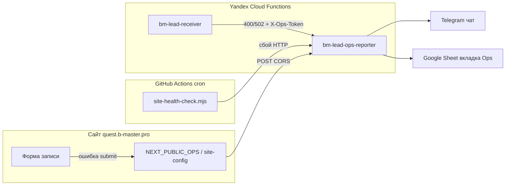

# Ops-алерты и мониторинг Quest Hub

Операционные уведомления при сбоях заявок и доступности сайта: Telegram, журнал в Google Sheets, проверка URL по расписанию **без VPS**.

Связанные материалы:

- Приём заявок: [static-hosting-s3-yandex.md](./static-hosting-s3-yandex.md) (раздел Yandex Lead Receiver)
- Чеклист продакшена: [timeweb-deploy-checklist.md](./timeweb-deploy-checklist.md)
- Код функции: [`apps/yandex-lead-ops-reporter/README.md`](../../apps/yandex-lead-ops-reporter/README.md)

## Задача

| Ситуация | Что видит админ |
|----------|-----------------|
| Пользователь не смог отправить заявку с сайта | Telegram + строка в **Ops** |
| `bm-lead-receiver` вернул 400/502 | Telegram + строка в **Ops** |
| Сайт не открывается, тормозит или отдаёт «пустую» страницу | Telegram + строка в **Ops** (каждые 15 мин, GitHub Actions) |

Сообщения в Telegram — **на русском** (заголовок понятный человеку, не сырой `lead.client_submit_failed`).

## Архитектура



### Компоненты

| Компонент | Путь / имя | Роль |
|-----------|------------|------|
| Ops-reporter | `apps/yandex-lead-ops-reporter`, YCF `bm-lead-ops-reporter` | Принимает JSON-события, шлёт Telegram и пишет в Sheet |
| Lead receiver | `apps/yandex-lead-receiver`, YCF `bm-lead-receiver` | Принимает заявки; при 400/502 вызывает ops-reporter |
| Клиент | `apps/web/lib/lead-submit-client.ts` | При ошибке формы — fire-and-forget POST в ops-reporter |
| Fallback UI | `BookingSubmitError`, `SupportContactStack` | Телефон + Telegram для родителя при сбое |
| Health check | `scripts/site-health-check.mjs` | HTTP smoke прод-URL |
| Cron | `.github/workflows/site-health.yml` | Запуск health check каждые 15 мин |

## Типы событий

| `event` | `source` | Когда срабатывает |
|---------|----------|-------------------|
| `lead.client_submit_failed` | `bm-questhub-static` | Браузер: нет URL приёма, HTTP ≠ 2xx, сеть |
| `lead.server_error` | `bm-lead-receiver` | Сервер: валидация/доставка заявки (400, 502) |
| `site.health_check_failed` | `bm-site-health` | GitHub Actions: главная или `/catalog` недоступны |

Коды ошибок (`errorCode`): `invalid_payload`, `delivery_failed`, `network`, `not_configured`, `site_unreachable`, `site_slow`, `site_bad_response`.

### Пример текста в Telegram

```
⚠️ Заявка не отправилась с сайта

Сервис заявок временно недоступен

Сервис заявок не ответил

👤 Иван Иванов
📞 +7 999 000-00-00
🎯 Minecraft

🕒 21.05.2026, 15:30:00 (МСК)
📡 Сайт Quest Hub · форма заявки
HTTP 502
ID verify-all-...
```

Для мониторинга заголовок: **«Проблема с доступностью сайта»**, источник: **«Автопроверка · GitHub Actions»**.

## Первичная настройка (один раз)

### 1. Yandex Cloud

```bash
make deploy-yandex-lead-ops-reporter
# или: node scripts/deploy-yandex-lead-ops-reporter.mjs
```

Скрипт:

- Деплоит `bm-lead-ops-reporter` (копирует Telegram/Sheets из lead-receiver)
- Патчит `bm-lead-receiver`: `OPS_REPORT_URL`, `OPS_REPORT_TOKEN`
- Пишет локальные заметки в `secret/ops-reporter.deploy.txt` и `secret/ops-reporter.token` (gitignored)

По умолчанию после создания вкладки Ops: `GOOGLE_OPS_SHEET_RANGE=Ops!A:M`.

### 2. Вкладка Ops в Google Sheet

Та же таблица, что и для заявок (`GOOGLE_SHEETS_SPREADSHEET_ID` на lead-receiver).

```bash
make setup-ops-sheet
# или: node scripts/setup-ops-sheet.mjs
```

Колонки A–M — см. [`apps/yandex-lead-ops-reporter/README.md`](../../apps/yandex-lead-ops-reporter/README.md).

### 3. Timeweb (статический сайт)

В App Platform → Environment (build-time):

| Переменная | Назначение |
|------------|------------|
| `NEXT_PUBLIC_LEAD_SUBMIT_URL` | URL `bm-lead-receiver` |
| `NEXT_PUBLIC_OPS_REPORT_URL` | URL `bm-lead-ops-reporter` |

Дублирование в репозитории (на случай, если Timeweb не прокинет `NEXT_PUBLIC_*` в клиентский бандл):

- `apps/web/data/v2/site-config.json` → `brand.contacts.leadSubmitUrl`, `opsReportUrl`
- После изменения: `make s3-sync-data-cold` и redeploy приложения

Пример значений: [`apps/web/timeweb.app.env.example`](../../apps/web/timeweb.app.env.example).

```bash
make timeweb-deploy
```

### 4. GitHub (мониторинг без VPS)

```bash
make setup-github-ops
# или: node scripts/github-ops-setup.mjs --trigger-health
```

Требуется `secret/github.token` или `GITHUB_TOKEN` с правами на repo secrets/variables.

| Тип | Имя | Значение |
|-----|-----|----------|
| Variable | `OPS_REPORT_URL` | Invoke URL ops-reporter |
| Variable | `SITE_HEALTH_URLS` | URL через запятую (по умолчанию главная + `/catalog`) |
| Secret | `OPS_REPORT_TOKEN` | Тот же токен, что на функциях |

Workflow: [`.github/workflows/site-health.yml`](../../.github/workflows/site-health.yml), cron `*/15 * * * *` (UTC).

Для `content-rebuild.yml` можно задать variable `OPS_REPORT_URL` — подставляется в `NEXT_PUBLIC_OPS_REPORT_URL` при сборке.

## Аутентификация запросов к ops-reporter

| Кто шлёт | Как |
|----------|-----|
| `bm-lead-receiver` | Заголовок `X-Ops-Token: <OPS_REPORT_TOKEN>` |
| Браузер | `Origin` из `ALLOWED_ORIGINS` (без токена), rate limit 1/min на `contact+offerId+IP` |
| GitHub Actions | `X-Ops-Token` |

Ответ всегда **202** после best-effort доставки (даже если Telegram временно недоступен — ошибка в логах YCF).

## Переменные health-check (опционально)

| Env | По умолчанию | Смысл |
|-----|--------------|--------|
| `SITE_HEALTH_URLS` | `https://quest.b-master.pro/,https://quest.b-master.pro/catalog` | Список URL |
| `SITE_HEALTH_TIMEOUT_MS` | `20000` | Таймаут запроса |
| `SITE_HEALTH_SLOW_MS` | `8000` | Порог «медленный ответ» |
| `SITE_HEALTH_MIN_BODY_BYTES` | `500` | Минимальный размер HTML |
| `SITE_HEALTH_MUST_CONTAIN` | `BrainMaster\|Quest Hub` | Подстроки в теле ответа |

## Проверка и smoke-тесты

Полный прогон:

```bash
make ops-verify-all
```

Включает: unit-тесты ops-reporter, `site-health-check`, smoke POST в prod, проверку что URL ops в JS-бандле страницы `/agenda/` (там подключается форма записи).

Отдельно:

```bash
make site-health-check
node scripts/check-prod-ops-bundle.mjs
cd apps/yandex-lead-ops-reporter && npm test
```

Ручной smoke в ops-reporter (нужен токен из `secret/ops-reporter.token`):

```bash
node -e "
const fs=require('fs');
const token=fs.readFileSync('secret/ops-reporter.token','utf8').trim();
const url=fs.readFileSync('secret/ops-reporter.deploy.txt','utf8').match(/OPS_REPORT_URL=(.+)/)[1];
fetch(url,{method:'POST',headers:{'content-type':'application/json','x-ops-token':token},body:JSON.stringify({event:'lead.client_submit_failed',source:'bm-questhub-static',occurredAt:new Date().toISOString(),errorCode:'delivery_failed',errorMessage:'Ручной smoke',requestId:'manual-'+Date.now()})}).then(r=>r.text()).then(console.log);
"
```

Проверка с сайта: DevTools → Network → заблокировать `LEAD_SUBMIT_URL` → отправить форму на `/agenda/` → должен уйти POST на ops-reporter и прийти Telegram.

## Make-цели (сводка)

| Цель | Действие |
|------|----------|
| `deploy-yandex-lead-ops-reporter` | Деплой YCF + патч lead-receiver |
| `setup-ops-sheet` | Вкладка Ops + заголовки |
| `setup-github-ops` | GitHub vars/secrets для cron |
| `site-health-check` | Локальный HTTP smoke |
| `ops-verify-all` | Полная верификация стека |

## Устранение неполадок

| Симптом | Вероятная причина | Действие |
|---------|-------------------|----------|
| Нет Telegram, в логах YCF «Google Sheet» | Раньше падала запись в несуществующую вкладку `Ops` | `make setup-ops-sheet`, redeploy ops-reporter |
| Нет алертов с сайта | Нет URL в бандле / не та страница | Проверить `site-config` + redeploy Timeweb; тест на `/agenda/` |
| GitHub workflow падает | Нет `OPS_REPORT_URL` / `OPS_REPORT_TOKEN` | `make setup-github-ops` |
| Дубликаты алертов с формы | Rate limit 1/min | Ожидаемо; смотреть `deduped: true` в ответе 202 |
| Cron не запускается | Только `workflow_dispatch` | Подождать 15 мин UTC или Actions → Run workflow |

Логи функции:

```bash
yc logging read --folder-id=<folder> --resource-ids=<ops-function-id> --since=1h --limit=30
```

## Секреты (не в git)

| Файл | Содержимое |
|------|------------|
| `secret/ops-reporter.token` | `OPS_REPORT_TOKEN` |
| `secret/ops-reporter.deploy.txt` | URL, подсказки Timeweb/GitHub |
| `secret/github.token` | Для `setup-github-ops` |
| `scripts/timeweb.env` | Timeweb API (деплой сайта) |

## История и журнал

Технические детали внедрения: [execution-log.md](../execution-log.md) (записи 2026-05-21).
