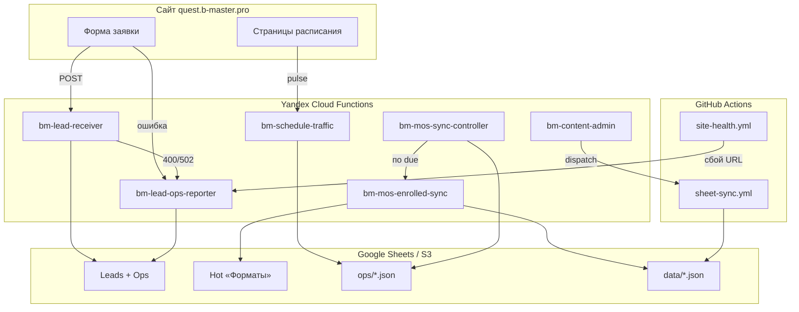

# Yandex Cloud Functions — шпаргалка

Сводная таблица **всех serverless-функций** Quest Hub в Yandex Cloud: что делает каждая, **чем запускается**, куда смотреть подробности.

| Функция | Роль | Триггер | Деплой / проверка |
|---------|------|---------|-------------------|
| [`bm-lead-receiver`](../../apps/yandex-lead-receiver/) | Приём заявок с сайта → Telegram, Google Sheets, n8n | **HTTP POST** с браузера (`NEXT_PUBLIC_LEAD_SUBMIT_URL`) | Ручной zip / `yc` (см. [static-hosting-s3-yandex.md](./static-hosting-s3-yandex.md)); env-патч: `node scripts/yandex-lead-receiver-env-patch.mjs` |
| [`bm-lead-ops-reporter`](../../apps/yandex-lead-ops-reporter/) | Ops-алерты: Telegram + вкладка **Ops** | **HTTP POST**: браузер (ошибка формы), `bm-lead-receiver` (400/502), GitHub **site-health** (каждые 15 мин) | `make deploy-yandex-lead-ops-reporter` |
| [`bm-content-admin`](../../apps/yandex-content-admin/) | API Sheet→S3: `/sync/hot`, `/sync/cold`, снимки | **HTTP** из Google Apps Script / [`apps/admin`](../../apps/admin/) | `make deploy-yandex-content-admin` |
| [`bm-mos-sync-controller`](../../apps/yandex-mos-sync-controller/) | PID-регулятор: когда вызывать sync | **Таймер** `bm-mos-sync-controller-timer` — `0/2 * * * ? *` | `make deploy-yandex-mos-sync-adaptive` |
| [`bm-mos-enrolled-sync`](../../apps/yandex-mos-enrolled-sync/) | `enrolled` с mos.ru → Hot Sheet → publish | **Вызов** из controller (в B1 **без** своего таймера) | B1: adaptive; B2 legacy: `make deploy-yandex-mos-enrolled-sync` (+ таймер 15m) |
| [`bm-schedule-traffic`](../../apps/yandex-schedule-traffic/) | Pulse визитов расписания → S3 | **HTTP POST** с сайта (`NEXT_PUBLIC_SCHEDULE_PULSE_URL`) | `make deploy-yandex-mos-sync-adaptive` |

Подробности по доменам:

- Заявки и мониторинг → [ops-alerts-and-monitoring.md](./ops-alerts-and-monitoring.md)
- Контент из Sheets → [content-deploy.md](./content-deploy.md)
- Mos.ru / расписание → [mos-enrolled-sync.md](../data/mos-enrolled-sync.md)

---

## Схема (кто кого вызывает)



---

## Команды (шпаргалка)

### Mos / расписание (production B1)

```bash
make setup-sheets-env
make deploy-yandex-mos-sync-adaptive    # controller + traffic + sync, без 15m-таймера на sync
make verify-mos-sync-adaptive           # функции + bm-mos-sync-controller-timer
make diagnose-mos-sync-ycf              # S3 state + invoke controller/sync

# Ручной тик / dry-run
yc serverless function invoke --name bm-mos-sync-controller --data '{}'
yc serverless function invoke --name bm-mos-enrolled-sync --data '{"dryRun":true}'

# Только пересборка одной функции
make redeploy-yandex-mos-sync-controller
make redeploy-yandex-mos-enrolled-sync
node scripts/redeploy-yandex-schedule-traffic.mjs
```

После деплоя: `secret/mos-sync-adaptive.deploy.txt` → `NEXT_PUBLIC_SCHEDULE_PULSE_URL` на Timeweb.

### Заявки и ops

```bash
make deploy-yandex-lead-ops-reporter   # + патч bm-lead-receiver (OPS_REPORT_*)
make setup-ops-sheet
make setup-github-ops                # secrets для site-health.yml
make ops-verify-all
```

### Контент (Sheets → S3)

```bash
make deploy-yandex-content-admin
make setup-content-admin             # → secret/content-admin.deploy.txt
make publish-sheet-hot               # локально без YCF
make publish-sheet-cold
```

### Локальная отладка mos (не вместо YCF daemon)

```bash
make mos-enrolled-sync-dry
make mos-enrolled-sync-on && make mos-enrolled-sync
```

---

## Секреты и артефакты (gitignored)

| Файл | Содержимое |
|------|------------|
| `secret/mos-sync-adaptive.deploy.txt` | URL traffic/controller/sync после adaptive-деплоя |
| `secret/mos-enrolled-sync.cookies.json` | Опционально: cookies mos.ru, если API режет YCF |
| `secret/ops-reporter.deploy.txt` | URL ops-reporter |
| `secret/content-admin.deploy.txt` | URL + токен content-admin |

---

## Что не смешивать

| Конфликт | Почему |
|----------|--------|
| `deploy-yandex-mos-sync-adaptive` **и** `deploy-yandex-mos-enrolled-sync` (таймер 15m на sync) | Два планировщика sync |
| YCF `bm-mos-sync-controller-timer` **и** cron в [mos-sync-controller.yml](../../.github/workflows/mos-sync-controller.yml) | Двойной тик controller |
| `make mos-enrolled-sync-daemon` **и** YCF adaptive | Два цикла sync |
| GHA [mos-enrolled-sync.yml](../../.github/workflows/mos-enrolled-sync.yml) cron **и** YCF | Cron в workflow **выключен** — только `workflow_dispatch` |

---

## GitHub Actions (не YCF, но связаны)

| Workflow | Расписание | Куда бьёт |
|----------|------------|-----------|
| [site-health.yml](../../.github/workflows/site-health.yml) | каждые 15 мин | `bm-lead-ops-reporter` |
| [sheet-sync.yml](../../.github/workflows/sheet-sync.yml) | по dispatch | S3 + (cold) Timeweb; стартует из content-admin |
| [mos-sync-controller.yml](../../.github/workflows/mos-sync-controller.yml) | **выкл** | Резерв controller; при YCF-таймере не включать cron |
| [mos-enrolled-sync.yml](../../.github/workflows/mos-enrolled-sync.yml) | **выкл** | Ручной sync |

---

## Переменные на статическом сайте (Timeweb)

| Переменная | Функция / назначение |
|------------|----------------------|
| `NEXT_PUBLIC_LEAD_SUBMIT_URL` | `bm-lead-receiver` |
| `NEXT_PUBLIC_OPS_REPORT_URL` | `bm-lead-ops-reporter` (ошибки формы в браузере) |
| `NEXT_PUBLIC_SCHEDULE_PULSE_URL` | `bm-schedule-traffic` |

См. [`apps/web/timeweb.app.env.example`](../../apps/web/timeweb.app.env.example) и `site-config.json`.

---

## Код и скрипты

| Путь | Назначение |
|------|------------|
| `apps/yandex-*/` | Исходники YCF |
| `scripts/deploy-yandex-*.mjs` | Деплой |
| `scripts/verify-mos-sync-adaptive.mjs` | Проверка mos-стека |
| `scripts/diagnose-mos-sync-ycf.mjs` | Полная диагностика (S3 + invoke) |
| `scripts/lib/mos-*.mjs`, `schedule-traffic.mjs` | Общая логика (копируется в YCF при сборке) |

Индекс deployment-доков: [README.md](./README.md).
